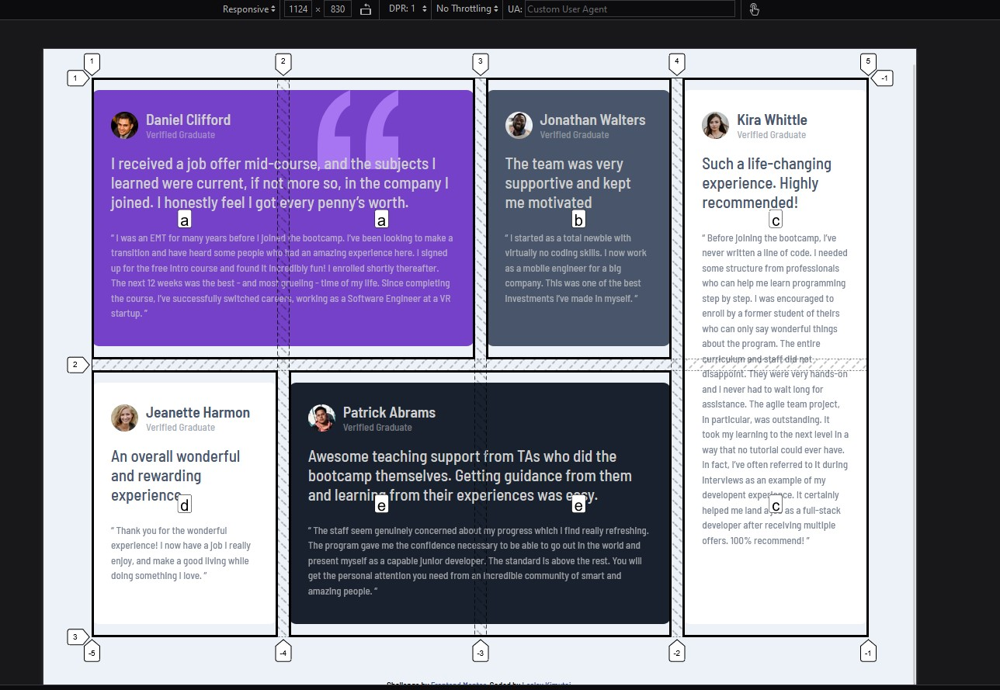

# Frontend Mentor - Testimonials grid section solution

This is a solution to the [Testimonials grid section challenge on Frontend Mentor](https://www.frontendmentor.io/challenges/testimonials-grid-section-Nnw6J7Un7). Frontend Mentor challenges help you improve your coding skills by building realistic projects.

## Table of contents

- [Overview](#overview)
  - [The challenge](#the-challenge)
  - [Screenshot](#screenshot)
  - [Links](#links)
- [My process](#my-process)
  - [Built with](#built-with)
  - [What I learned](#what-i-learned)
  - [Continued development](#continued-development)
  - [Useful resources](#useful-resources)
- [Author](#author)
- [Acknowledgments](#acknowledgments)

## Overview

### The challenge

Users should be able to:

- View the optimal layout for the site depending on their device's screen size

### Screenshot

- Mobile view of the Testimonials Section(No grid used here) :-


- Laptop view of the Testimonials Section(Grid used here -shown in the screenshot) :-



### Links

- Solution URL: [Github Link](https://github.com/issagoodlifeInc/testimonial-grid-sections.git)
- Live Site URL: [Live Site -Netlify](https://testimonys-grid.netlify.app/)

## My process

### Built with

- Semantic HTML5 markup
- CSS custom properties
- Flexbox
- CSS Grid
- Mobile-first workflow

### What I learned

Using CSS Grid -- mainly template-areas and template-columns [Had a bit of quirks but got to the final markup eventually]

Using CSS Grid for the large screens layout:

```css
@media only screen and (min-width: 1000px) {
  main {
    display: grid;
    gap: 15px;
    /* Repeats four collums taking the same amount of spacing */
    grid-template-columns: repeat(4, 1fr);
    /* Allocates a certain element to a specific area on the grid */
    grid-template-areas:
      "a a b c"
      "d e e c";
  }

  /* Setting the areas */
  .daniel {
    background: var(--moderateviolet) url("./images/bg-pattern-quotation.svg") no-repeat
      top right 25%;
    grid-area: a;
  }
  .jonathan {
    grid-area: b;
  }
  .jeanette {
    grid-area: d;
  }
  .kira {
    grid-area: c;
  }
  .patrick {
    grid-area: e;
    background: var(--vdkblackishblue);
  }
}
```

### Continued development

- Quicker tunaround time
- Better code (reducing redundancy)
- More creativity to tweak the challenge to my liking

### Useful resources

- [MDN Docs on Grid Templete Areas](https://developer.mozilla.org/en-US/docs/Web/CSS/grid-template-areas) - This helped me use grid-tempelete-areas to style the testimonials as per the mockup given.

## Author

- Website - [Lesley Kimutai](https://leskimfamily.herokuapp.com/lesley)
- Frontend Mentor - [@leskim](https://www.frontendmentor.io/profile/leskim)
- Twitter - [@KimutaiLesley](https://www.twitter.com/KimutaiLesley)

## Acknowledgments

Kibenon - Helped him complete a part of the challenge hence was set up to do it in a little less time.

[His Completed Challenge]("https://www.frontendmentor.io/solutions/testimonials-sections-using-grid-LDyXDrBAE3")
